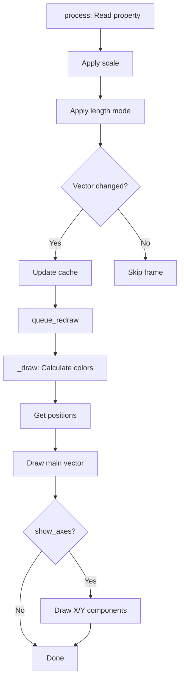

## Architecture Overview

Vector Display 2D is built on Godot's node system and uses a smart, performance-optimized rendering pipeline. The addon captures vector data from a target node and visualizes it in real-time using Godot's drawing API.

### Core Components

The system consists of three main components:

1. **VectorDisplay2D** - The main visualization node that extends `Node2D`
2. **VectorDisplaySettings** - A `Resource` that stores all configuration options
3. **VectorDisplayFunctions** - Static utility functions for calculations and validation

<Info>
The separation of logic into static functions allows for future 3D support without code duplication.
</Info>

## Vector Capture Process

The addon uses Godot's reflection system to dynamically read vector properties from any node.

### Target Validation

During initialization in `_ready()`, the system validates the target configuration:

```gdscript vector_display_2d.gd:18-22
func _ready() -> void:
    VectorDisplayFunctions.check_targets_and_settings(self, target_node, target_property, settings)
    
    # Redraw automatically when settings change
    settings.changed.connect(queue_redraw)
```

The validation function ensures:
- Target node exists (auto-assigns to parent if not set)
- Target property exists and is a `Vector2`
- Settings resource is configured

<Note>
If no target node is specified, the addon automatically uses the parent node. This makes setup faster for common use cases.
</Note>

### Dynamic Property Reading

Every frame, the `_process()` function reads the current vector value:

```gdscript vector_display_2d.gd:26-40
func _process(_delta) -> void:
    if not is_instance_valid(target_node): return
    
    var new_vector: Vector2 = target_node.get(target_property) * settings.vector_scale
    var new_raw_length := new_vector.length()
    
    new_vector = VectorDisplayFunctions.apply_lenght_mode(new_vector, settings)
    
    # Improves performance, rendering only when is necesary
    if current_vector == new_vector and is_equal_approx(current_raw_length, new_raw_length): return
    
    current_vector = new_vector
    current_raw_length = new_raw_length
    queue_redraw()
```

The process follows these steps:

1. **Read** - Uses `get()` to retrieve the property value
2. **Scale** - Applies `vector_scale` for visual sizing
3. **Transform** - Applies length mode (Normal, Clamp, or Normalize)
4. **Compare** - Checks if the vector actually changed
5. **Queue** - Only triggers redraw if necessary

## Smart Redraw System

One of the key performance optimizations is the **smart redraw** mechanism.

### Performance Optimization

Instead of redrawing every frame, the system only triggers `queue_redraw()` when:

- The vector value changes (`current_vector == new_vector`)
- The raw length changes (using `is_equal_approx()` for floating-point comparison)
- Settings are modified (via `settings.changed` signal)

<Accordion title="Why track both vector and raw length?">
The system tracks both the processed vector and the raw length separately because:

- **Processed vector** - Used for actual rendering, includes scale and length mode transformations
- **Raw length** - Used for color dimming calculations to show the true magnitude

This allows dimming effects to work correctly even when vectors are clamped or normalized.
</Accordion>

### Automatic Settings Updates

The settings resource emits a `changed` signal whenever any property is modified:

```gdscript vector_display_2d.gd:22
settings.changed.connect(queue_redraw)
```

This means any runtime changes to colors, widths, or display modes instantly trigger a redraw without manual intervention.

## Drawing and Rendering

The `_draw()` function handles all visual output using Godot's 2D drawing API.

### Main Vector Rendering

```gdscript vector_display_2d.gd:43-51
func _draw() -> void:
    if not settings.show_vectors: return
    
    var colors := VectorDisplayFunctions.calculate_draw_colors(current_vector, current_raw_length, settings)
    
    # Main vector calculations and render, according to mode
    var current_vector_position := VectorDisplayFunctions.get_main_vector_position(current_vector, settings)
    draw_line(current_vector_position.begin, current_vector_position.end, colors.main, settings.width, true)
    _draw_arrowhead(current_vector_position.begin, current_vector_position.end, colors.main)
```

### Axes Component Rendering

When `show_axes` is enabled, the system draws X and Y components:

```gdscript vector_display_2d.gd:53-62
if not settings.show_axes: return

# Axes calculations and render, according to mode
var current_axes_pos := VectorDisplayFunctions.get_axes_positions(current_vector, settings)

# Components render
draw_line(current_axes_pos.x_begin, current_axes_pos.x_end, colors.x, settings.width, true)
_draw_arrowhead(current_axes_pos.x_begin, current_axes_pos.x_end, colors.x)
draw_line(current_axes_pos.y_begin, current_axes_pos.y_end, colors.y, settings.width, true)
_draw_arrowhead(current_axes_pos.y_begin, current_axes_pos.y_end, colors.y)
```

### Arrowhead Drawing

Arrowheads are drawn as triangular polygons with automatic sizing:

```gdscript vector_display_2d.gd:66-87
func _draw_arrowhead(start: Vector2, position: Vector2, color: Color) -> void:
    if not settings.arrowhead: return
    
    var director := (position - start).normalized()
    var actual_size := settings.width * settings.arrowhead_size * 2
    
    # Adds a extra lenght for fix bad rendering or arrowhead
    var offset := director * settings.width * settings.arrowhead_size
    
    # Hides arrowhead if vector is very small. If not, continue
    if offset.length() > (position - start).length(): return
    var actual_position := position + offset
    
    draw_polygon(
        # Rotate 30 degrees to both sides
        PackedVector2Array([
            actual_position,
            actual_position - director.rotated(PI / 6) * actual_size,
            actual_position - director.rotated(-PI / 6) * actual_size
        ]),
        PackedColorArray([color, color, color])
    )
```

<Info>
Arrowheads automatically hide when vectors become too small, preventing visual clutter.
</Info>

## Rendering Pipeline Summary

The complete rendering flow:



## Color Calculations

Colors are calculated dynamically based on settings using `vector_display_functions.gd:34-69`:

1. **Base colors** - Start with configured colors
2. **Rainbow mode** - Calculate hue from vector angle
3. **Dimming** - Lerp towards fallback color based on magnitude

<Accordion title="Rainbow color calculation">
```gdscript vector_display_functions.gd:46-51
if settings.rainbow:
    var angle: float = vector.angle()
    if angle < 0: angle += TAU
    
    colors.main = Color.from_hsv(angle / TAU, 1.0, 1.0)
```

The angle is normalized to 0-1 range and used as the hue value in HSV color space, creating a full spectrum based on direction.
</Accordion>

## Keyboard Shortcut Handling

The system includes built-in keyboard shortcut support for toggling visibility:

```gdscript vector_display_2d.gd:91-93
func _unhandled_key_input(event: InputEvent) -> void:
    if VectorDisplayFunctions.check_shortcut(event, settings):
        get_viewport().set_input_as_handled()
```

This prevents the input from propagating to other nodes when handled.
